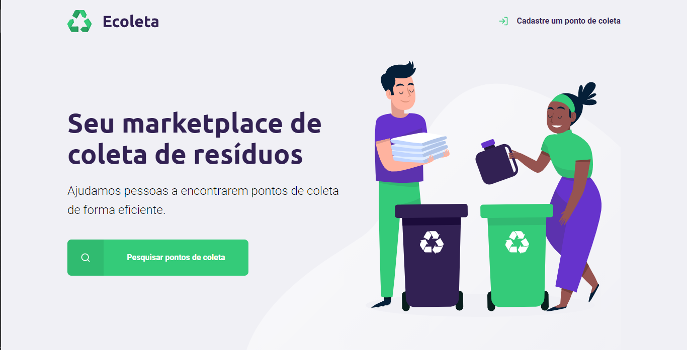
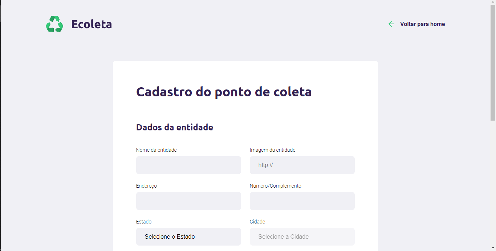
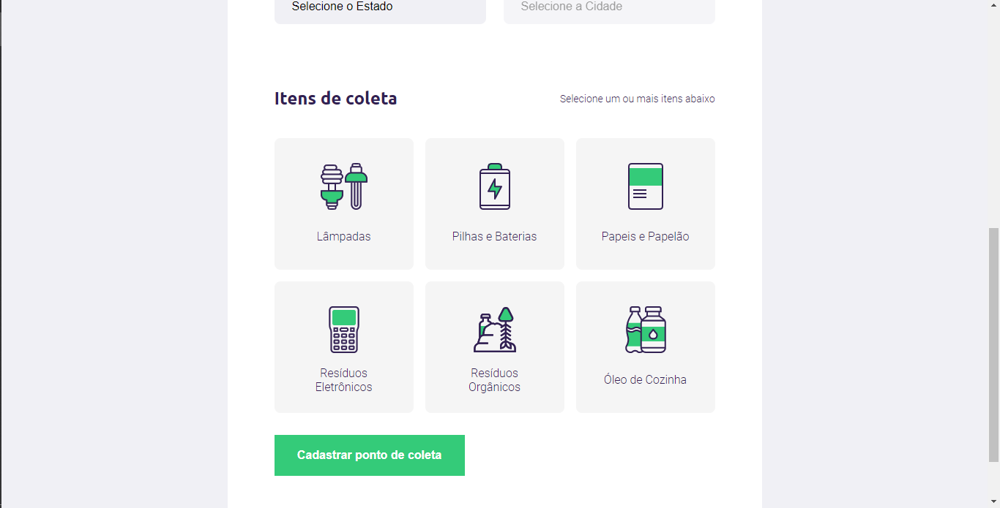
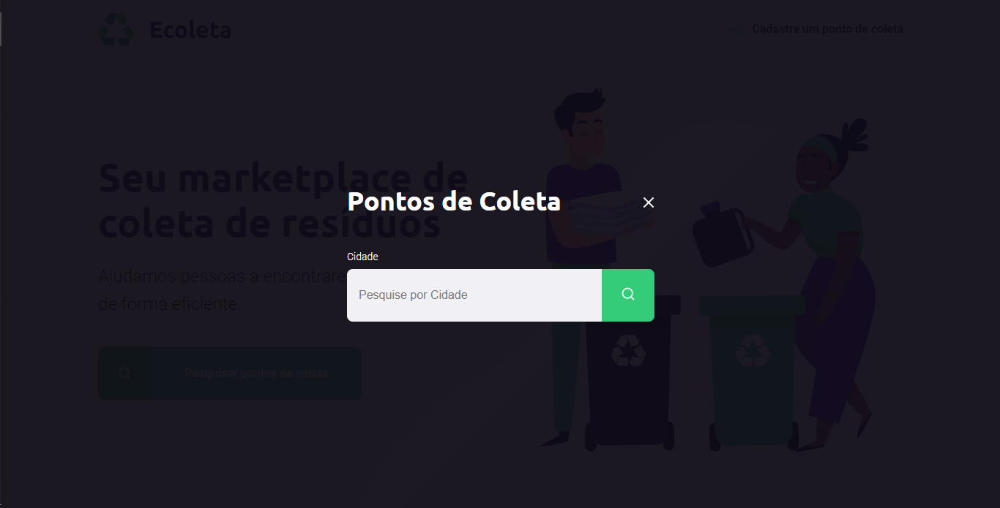

# Ecoleta ♻️
#### Esse projeto foi orgulhosamente criado durante a terceira next level week, bootcamp prestado pela <b>Rocketseat</b> com a ajuda do nosso querido professor Mayk Brito. 

## Sumário

- [Imagens](#Imagens)
- [Instalação](#instalação)
- [Sobre/Uso](#Sobre/uso)

## Imagens

## Instalação

Clone esse repositório na sua pasta local

`git clone https://github.com/alvaropsouza/nextLevelWeek01.git`

Recomendamos usar a versão 10.x do node js para maior compatibilidade com o projeto, para isso você pode usar o node version manager para alternar para a versão desejada.

<i>Nvm para windows OS</i>

https://github.com/coreybutler/nvm-windows

<i>Nvm para linux OS</i>

https://github.com/nvm-sh/nvm

<b>Instale as dependências utilizadas no projeto</b>

`npm install`

Inicie o servidor

`npm start`

Agora basta abrir no seu navegador uma aba com o seguinte endereço:

`http://localhost:3000/` (<i>Endereço que consta no server.js</i>)
## Sobre/Uso

O projeto Ecoleta foi criado com o intuito de identificar pontos de coleta nas próximidades do usuário e ajudar no combate ao descarte inadequado de resíduos.

## Contributing

Por favor, contribua usando o github flow [Github Flow](https://guides.github.com/introduction/flow/). Crie uma branch, adicione commits e [Abra um pull request](https://github.com/fraction/readme-boilerplate/compare/).
